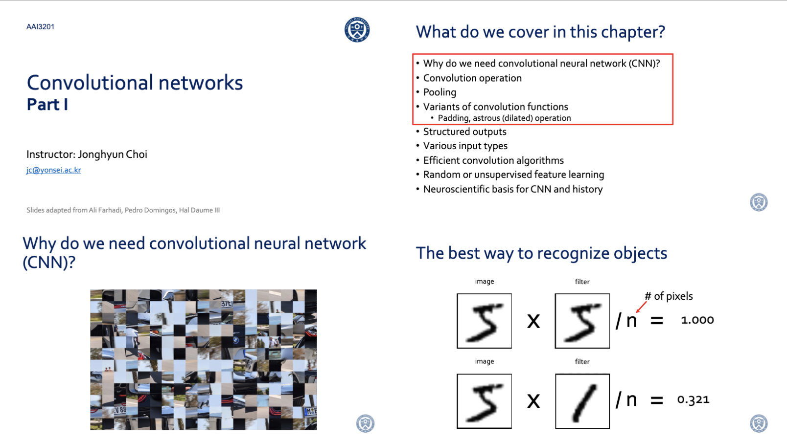

# PDF Merger

This repository contains the `cat.py` file, which is a Python script for merging multiple PDF pages into one page.

## Usage

To use the `cat.py` script, follow these steps:

1. Clone the repository: `git clone https://github.com/three0-s/pdf-merger.git`
2. Navigate to the repository directory: `cd pdf-merger`
3. Run the script: `python cat.py <path>`

Replace `<path>` with the root directory that contains the PDF files you want to merge.

It does something like this:

 

to this:

## Requirements

To run the `cat.py` script, you need to have the following dependencies installed:

- Python 3.x
- PyPDF2

You can install the required dependencies by running the following command: `pip install PyPDF2`
